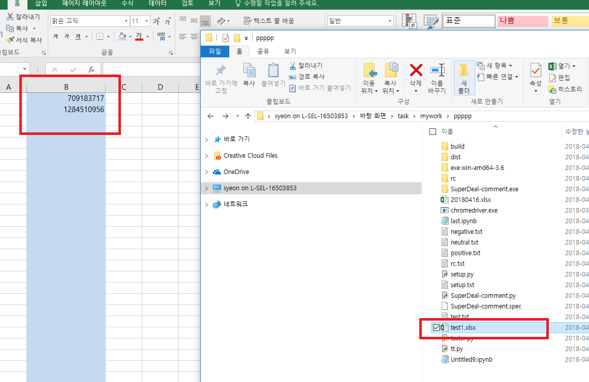
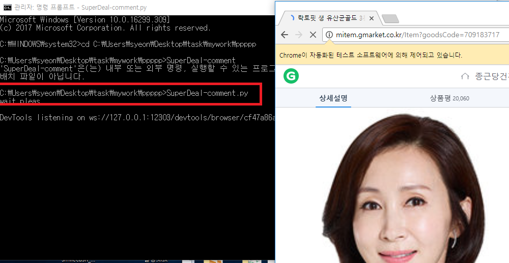
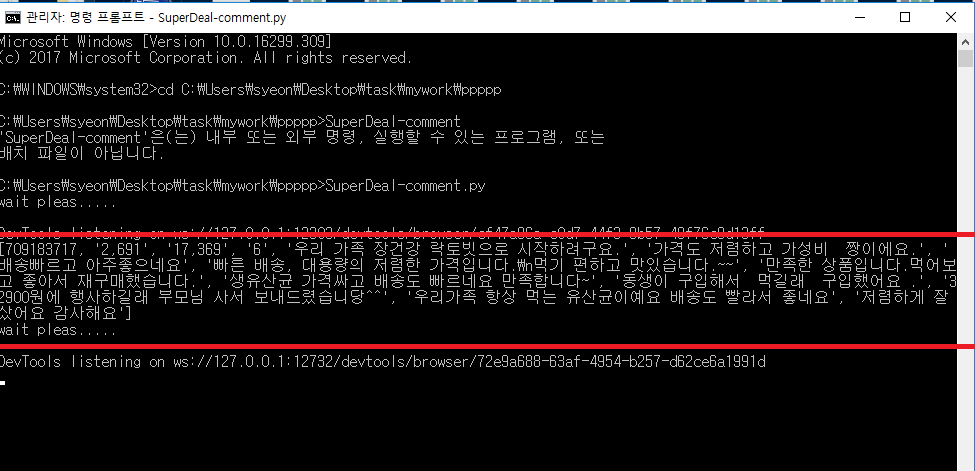
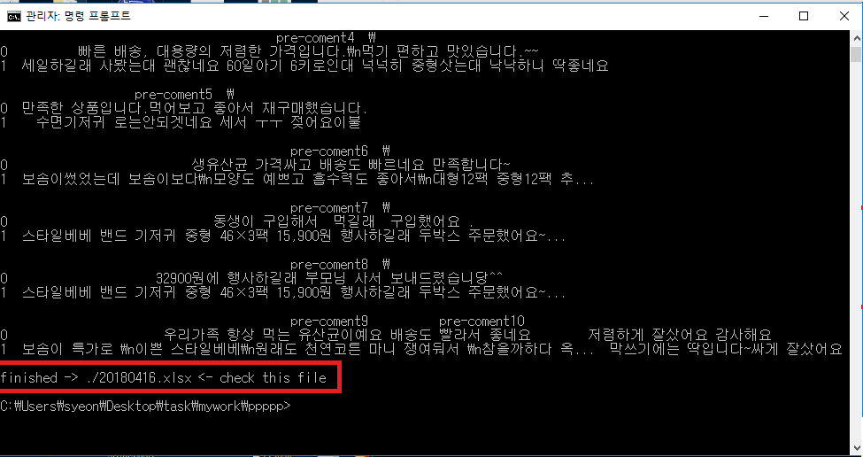
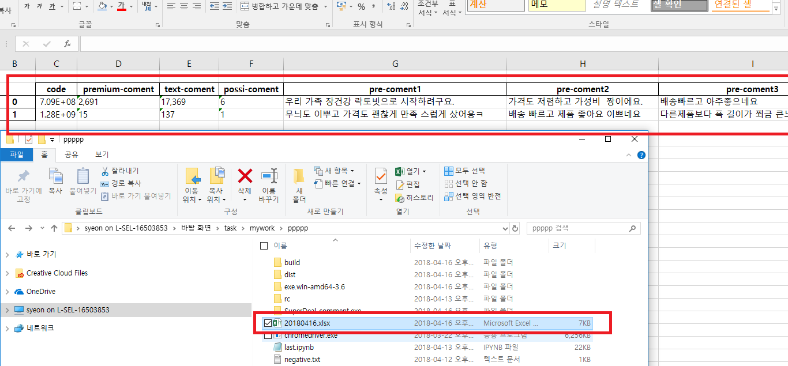

# 버전 0.2이 새로 나왔습니다!!
==========>>>> 
# [EXE파일로 파이썬이 없어도 OK, SuperDeal크롤링 버전 0.2 !!](https://github.com/itziana/SuperDeal2).

# 버전 0.2 변경사항
> 1) 파이썬이 설치되지 않은 컴퓨터에서도 EXE 실행파일로 사용이 가능
> 2) 형태소 분석을 통한 긍정,부정 코멘트 판별문 삭제 (JAVA로 인한 오류와 정확도 문제로 제거)
> 3) 일반 코멘트의 경우 상위 50개를 추가로 긁어와 매우추천, 추천, 보통, 추천안함 의 숫자 카운트 추가
> 4) 크롬 헤드레스로 크롤링 동작을 보여주는 웹페이지 숨김처리 
> 5) 등록한 상품코드가 잘못되었을 경우 오류메시지(타입익셉션) 출력
> 6) 상품코드를 제외한 모든 카운트는 숫자형(int)으로 출력


# 아래는 (구버전) 슈퍼딜 크롤링 0.1 소개  (상품평 카운트, 긍정판별기)
================================
(비개발자, 영업담당자가 간단히 만든 크롤링 매크로 프로그램)
 

### 1. 슈퍼딜 상품의 최소 상품평 숫자(프리미엄상품평 3개이상, 일반상품평 10개 이상)와, 각 상품평의 긍정/부정/중립 숫자(프리미엄 상품평 긍정 1개, 일반 5개 이상)를 자동으로 판별하기 위해 만든 코드
---------------------------------------

### 2. 매일 바뀌는 슈퍼딜 30개 (올킬 포함시 60개)의 상품페이지 열어가며 상품평을 수집하고 긍정/부정여부 판별
---------------------------------------

### 3. 일반 컴퓨터에서도 실행 될 수 있도록 EXE 확장자로의 패키징 방법도 확인중
---------------------------------------

### 4. 윈도우 10의 작업 스케줄러를 사용하면, 자동예약 작업도 가능
---------------------------------------
 
### 5. 동작 과정 (필요파일은 SuperDeal.7z 파일 사용가능)
---------------------------------------

#### 1) 상품코드 입력

 > a) 사용자는 test1 파일에 슈퍼딜 상품코드 입력 (현재 1회 40개까지 가능)
 
 


#### 2) 각 슈퍼딜 페이지에서 상품평 읽어오기

 > a) SuperDeal-comment.py 실행
 
 > b) SuperDeal-comment.py 파일이 test1의 상품코드들을 차례로 읽어와 하나씩 웹드라이버로 전달
 
 > c) 웹드라이버는 각 상품VIp 페이지 접속 후 상품평 페이지로 자동 이동
 
 > d) 상품평 페이지에 있는 상품평 수, 프리미엄 코멘트의 내용 저장 (크롤링, 뷰티풀스프)
 
 

#### 3) 프리미엄 상품평 감정 분석 (긍정/부정 분류 후 긍정 갯수 카운트) 

 > a) 읽어들인 정보 중 프리미엄 코멘트 내용은 Konlpy가 형태소 분류
 
 > b) positive, neutral, negative.txt 파일에 사전 저장된 각 단어와의 형태소 매칭통해 가장 높은 매칭률 보인 항목리턴
 
 > c) 출력된 항목 중 positive 매칭률이 가장높게 나온 코멘트 숫자 카운트 (긍정문 숫자)
 
 > * 긍정/부정 판별에 대한  형태소 분석으로 사용할 키워드들을 어떻게 넣느냐에따라 달라짐
 
  

#### 4) 엑셀파일로 결과 출력

 > a)  상품코드,프리미엄상품평 숫자, 일반상품평 숫자, 프리미엄상품평 긍정숫자, 프리미엄 상품평 최근 10개 를 작업 날짜의 엑셀파일명으로 출력

 
 


### 6. 개발환경
---------------------------------------
*감정 분석 부분은 아래 경로의 소스코드를 일부 수정해 적용했습니다
  http://newpower.tistory.com/127

 > a) 사용언어 : Python 3.6
 
 > b) 패키지 : Selenium, time, BeautifulSoup, openpyxl, pandas, datetime, konlpy
 
 > c) Chrome Webdriver
 
 > d) Java (한국어 형태서 분석을 위한 KoNLPy패키지 사용에 필요)

### 7. 사용시 주의사항
---------------------------------------
 > a) 프로그램 작업동안 test1 엑셀파일이 열려있으면 에러가 발생합니다
 
 > b) 기타 작업으로 컴퓨터의 속도가 크게 느려져있다면, 작업간 에러가 발생합니다 (상품VIP페이지를 여는데 1.5초이상 발생시)
 
 > c) 현재 test1 엑셀파일에 작성가능한 상품코드수는 1회 40개입니다 (변경가능)

### 8. 코드 (SuperDeal-comment.py)
---------------------------------------
# 패키지 임포트
```  
from selenium import webdriver
import time 
import selenium.webdriver
from bs4 import BeautifulSoup
import openpyxl
import pandas as pd
from datetime import datetime
from konlpy.tag import *
from konlpy.utils import pprint
```  

# 슈퍼딜 상품코드가 저장된 엑셀파일 불러오기
```  
wd = openpyxl.load_workbook('test1.xlsx')
ws = wd.active
alldfcontents = []
for r in ws.rows:
    row_index = r[0].row
    kor = r[1].value
    alldfcontents.append(kor)
    if row_index == 40:
        break
tt = list(filter(None.__ne__, alldfcontents))
```  
    
# 파싱을 받는 부분
```  
def Superdeal(a):   

    print("wait pleas.....")    
    driver = webdriver.Chrome('./chromedriver.exe')    
    driver.implicitly_wait(1.5)    
    driver.get('http://mitem.gmarket.co.kr/Item?goodsCode='+ a)    
    time.sleep(1)       
    driver.find_element_by_xpath('//*[@id="mainTab1"]/button').click()    
    time.sleep(1.5)    
    html = driver.page_source    
    soup = BeautifulSoup(html, 'html.parser')     
    driver.close()    
    return soup


#상품평 숫자를 가져온다
#프리미엄 상품평 숫자 contents5.span.text
#일반 상품평 숫자 contents6.span.text

def Countt(soup):

    contents5 = soup.find('a', { 'id': 'photoReviewTab' })
    contents6 = soup.find('a', { 'id': 'textReviewTab' })
    #print(contents5.span.text, contents6.span.text)
    countz = [contents5.span.text, contents6.span.text]
    #print(countz)
    return countz
  

#상품평을 가져온다

def Countt2(soup):    

    #soup = BeautifulSoup(html, 'html.parser')    
    contents0 = soup.find('div', { 'id': 'photoReviewArea' })
    contents02 = contents0.select('ul > li > a')
    dfcontent0 = []
    alldfcontents0 = []
    tdst = []
    i = 0
    for content00 in contents02:
        tds=content00.find_all("p")
        tds.pop(0)
        tds.pop(0)
        for td in tds:
            dfcontent0.append(td.text)
    return dfcontent0


# 긍정 부정 나누는 부분
# tag list (보통명사, 동사, 형용사, 보조동사, 명사추정범주) 
#-*- coding: utf-8 -*-

def monn(dfcontent0):

    kkma = Kkma()
    f_pos = open('positive.txt', 'r')
    f_neg = open('negative.txt', 'r')
    f_neu = open('neutral.txt', 'r')
    f_test = open('test.txt', 'r')
    list_tag = [u'NNG', u'VV', u'VA', u'VXV', u'UN']
    list_positive=[]
    list_negative=[]
    list_neutral=[]
    iii = 0  
    Q = 0
    for T in dfcontent0:
        test_s = dfcontent0[Q]
        test_list=kkma.pos(test_s)
        test_output=[]
        for i in test_list:
            if i[1] == u'SW':
                if i[0] in [u'♡', u'♥']:
                    test_output.append(i[0])
            if i[1] in list_tag:
                test_output.append(i[0])
        test_list=kkma.pos(test_s)
        Q = Q + 1    
        list_positive = getting_list(f_pos, list_positive)
        list_negative = getting_list(f_neg, list_negative)
        list_neutral = getting_list(f_neu, list_neutral)
        ALL = len(set(list_positive))+len(set(list_negative))+len(set(list_neutral))
        result_pos = naive_bayes_classifier(test_output, list_positive, ALL)
        result_neg = naive_bayes_classifier(test_output, list_negative, ALL)
        result_neu = naive_bayes_classifier(test_output, list_neutral, ALL)   
        if (result_pos > result_neg and result_pos > result_neu):
            #print ('긍정')
            iii = iii + 1
        elif (result_neg > result_pos and result_neg > result_neu):
            c = 1
            #print ('부정')
        else:
            #print ('중립')
            c = 0
    return iii
    print(iii)  
    f_pos.close()
    f_neg.close()
    f_neu.close()
    f_test.close()


def getting_list(filename, listname):

    kkma = Kkma()
    while 1:
        line = filename.readline()
        str = line
        #str = unicode(line, 'utf-8')
        line_parse = kkma.pos(str)
        list_tag = [u'NNG', u'VV', u'VA', u'VXV', u'UN']
        for i in line_parse:
            if i[1] == u'SW':
                if i[0] in [u'♡', u'♥']:
                    listname.append(i[0])
            if i[1] in list_tag:
                listname.append(i[0])
        if not line:
            break
    return listname
 
 
def naive_bayes_classifier(test, train, all_count):

    counter = 0
    list_count = []
    for i in test:
        for j in range(len(train)):
            if i == train[j]:
                counter = counter + 1
        list_count.append(counter)
        counter = 0
    list_naive = []
    for i in range(len(list_count)):
        try:
            list_naive.append((list_count[i]+1)/float(len(train)+all_count))
        except ZeroDivisionError:
            print("zero")
    result = 1
    for i in range(len(list_naive)):
        result *= float(round(list_naive[i], 6))
    return float(result)*float(1.0/3.0)
```  

# 최종 데이터프레임 형태 만들기, 엑셀 출력
```  
ala = []
for i in tt:
    cc2 = str(i)
    a = Superdeal(cc2)
    q2 =  Countt2(a)
    #print(q2)
    cc = monn(q2)
    ee = str(cc)
    cc2 =  Countt(a)
    cc2.extend(ee)
    yy = cc2
    yy.extend(q2)
    yy.insert(0, i)
    print(yy)
    ala.append(yy)
ala2 = ['code', 'premium-coment', 'text-coment', 'possi-coment', 'pre-coment1','pre-coment2', 'pre-coment3', 'pre-coment4', 'pre-coment5', 'pre-coment6', 'pre-coment7', 'pre-coment8', 'pre-coment9', 'pre-coment10']
df=pd.DataFrame(columns=ala2, data=ala)
dd1 = datetime.today().strftime("%Y%m%d")
dd = str(dd1)
da = './' + dd + '.xlsx'
df.to_excel(da,sheet_name='coupon2',header=True, startrow=1, startcol=1)
print(df)
print ('finished -> ' + da + ' <- check this file')

